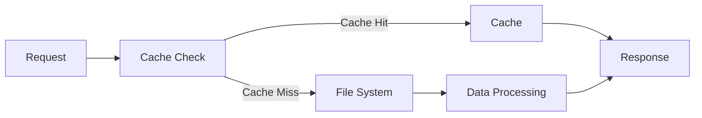
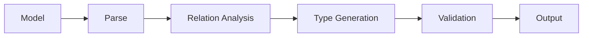

# Contentrain SDK Architecture

This document details the architectural structure and design decisions of the Contentrain SDK.

## 🏗️ Overview

Contentrain SDK is designed with a modular architecture consisting of three main packages:

1. **Core Package** (`@contentrain/query`)
   - Provides query SDK functionality
   - Framework-agnostic design
   - Forms the foundation for other packages

2. **Nuxt Module** (`@contentrain/nuxt`)
   - Nuxt.js integration
   - Provides Nuxt-specific features using the query package

3. **Type Generator** (`@contentrain/types-generator`)
   - Automatically generates TypeScript type definitions
   - Performs type inference from model definitions

## 📦 Package Details

### Core Package

#### Main Components

```
query/
├── src/
│   ├── loader/       # Content loading engine
│   ├── query/        # Query processor
│   ├── cache/        # Caching system
│   └── types/        # Base type definitions
```

#### Design Principles

1. **Modularity**
   - Each component can work independently
   - Loosely coupled design
   - Easy testability

2. **Performance**
   - LRU caching strategy
   - Lazy loading support
   - Minimal memory usage

3. **Type Safety**
   - Full TypeScript support
   - Generic type parameters
   - Type inference

### Nuxt Module

#### Main Components

```
nuxt/
├── src/
│   ├── module.ts     # Nuxt module definition
│   ├── runtime/      # Runtime helpers
│   └── composables/  # Vue composables
```

#### Integration Points

1. **Module Setup**
   - Nuxt hooks usage
   - Automatic type definition
   - Runtime configuration

2. **Composables**
   - Vue Composition API compatible
   - SSR support
   - Auto-import feature

3. **Build Optimizations**
   - Tree-shaking support
   - Code splitting
   - Minimal bundle size

### Type Generator

#### Main Components

```
types-generator/
├── src/
│   ├── generator/    # Type generation engine
│   ├── parser/       # Model parser
│   └── templates/    # Type templates
```

#### Generation Process

1. **Model Analysis**
   - JSON schema parsing
   - Relation detection
   - Type inference

2. **Type Generation**
   - TypeScript AST manipulation
   - Template-based generation
   - Prettier formatting

3. **Validation**
   - Type checking
   - Circular dependency detection
   - Error reporting

## 🔄 Data Flow

### Content Loading Process



### Query Processing Flow


### Type Generation Flow



## 🔒 Security

1. **Data Validation**
   - Input sanitization
   - Type checking
   - Schema validation

2. **Error Handling**
   - Detailed error messages
   - Safe debugging
   - Graceful degradation

3. **Resource Management**
   - Memory leak prevention
   - File handle management
   - Cache size control

## 📈 Performance

1. **Caching Strategy**
   - LRU (Least Recently Used) algorithm
   - Memory limit control
   - Automatic cleanup

2. **Lazy Loading**
   - Load on demand
   - Chunk-based data transfer
   - Progressive loading

3. **Bundle Optimization**
   - Tree-shaking
   - Code splitting
   - Minimal dependencies

## 🔄 Version Management

1. **Semantic Versioning**
   - Major: Backward incompatible changes
   - Minor: Backward compatible features
   - Patch: Bug fixes

2. **Change Management**
   - Changesets usage
   - Automatic version notes
   - Release workflow

## 🧪 Testing Strategy

1. **Unit Tests**
   - Isolated tests for each component
   - Mock and stub usage
   - 100% code coverage target

2. **Integration Tests**
   - Inter-package interaction tests
   - E2E scenarios
   - Performance tests

3. **Playground**
   - Example applications
   - Manual testing environment
   - Documentation examples
